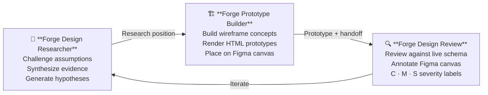
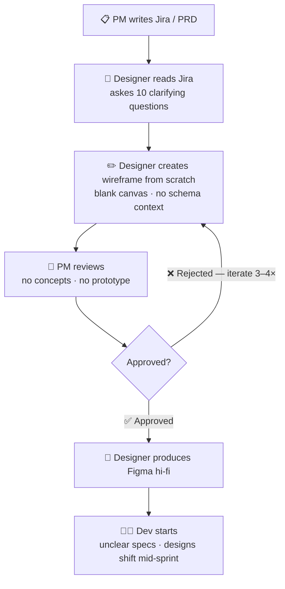
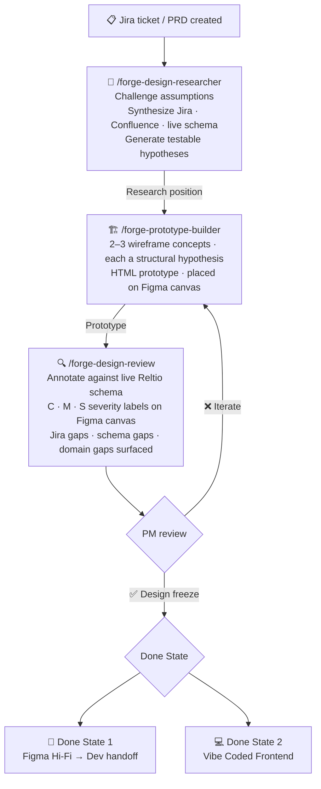
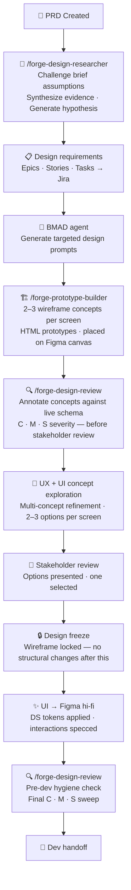
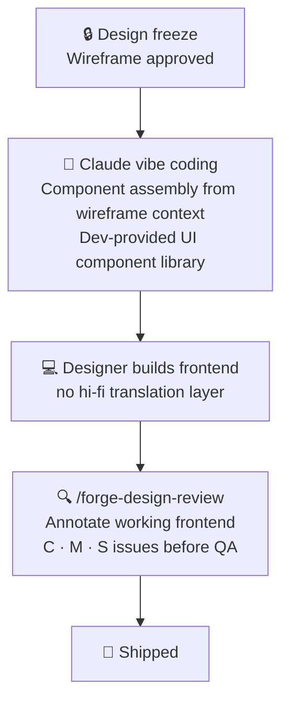

# Reltio Forge

> An agentic AI design pipeline purpose-built for Reltio MDM — from research to wireframe to Figma-annotated review, grounded in the live data model, Jira requirements, and Reltio's design system.

---

## The Problem

Manual design processes at Reltio take too long and miss too much. Designers start from zero — no context, no research, no schema awareness. PMs wait days for a first wireframe. Edge cases only surface in QA. And when a design finally reaches dev, it shifts mid-sprint because no one validated it against how Reltio actually works.

**Reltio Forge replaces that with a three-skill AI loop:**

1. Challenge the assumption before the design is built
2. Build concepts grounded in Reltio's DS and live data model
3. Review the output against the real schema — before dev touches it

---

## The Forge Skill Chain

Three skills. One loop. Each feeds the next.

---

## Skills

### `/forge-design-researcher` — Forge Design Researcher

**When it fires:** Before any design direction is committed. Challenges the structural assumptions embedded in a brief — *"stewards want fewer fields", "admins prefer a wizard"* — before those assumptions are built against.

> Prevents the most expensive design failure: building the right solution to the wrong problem.

| Capability | What it does |
|---|---|
| **Problem Reframe** | Identifies when the stated problem is a symptom. Reframes from user experience failure, not design gap. |
| **Assumption Challenge** | Names every untested belief in the brief. Delivers a verdict: ✅ Supported / ⚠️ Complicated / ❌ Unsupported / 🔁 Reframe needed. |
| **Evidence Synthesis** | Pulls signals from Jira tickets, Confluence research, and the live Reltio data model. Synthesizes into a research position — not a list. |
| **Hypothesis Generation** | Produces testable, 3-part hypotheses: the belief, the reason, the test. Gives design a sharp direction to build against. |
| **Jira signal mining** | Reads bug reports and ticket comments as research signals. A ticket titled "steward clicking wrong button" is a usability finding, not just a bug. |
| **Confluence synthesis** | Finds past research, session notes, persona work, and journey maps. Never duplicates research already done. |
| **Live schema reality check** | Calls `get_reltio_entity_types` and `get_reltio_entity_type_attributes`. If a designer believes "users are overwhelmed by too many fields" — checks how many fields actually exist in the tenant. |
| **Figma hypothesis extraction** | Reads an existing design not to critique it — but to surface the assumptions embedded in every layout decision. |
| **MDM field notes** | Institutional memory from 200+ sessions with Reltio data stewards, MDM admins, and data analysts across pharma, retail, and financial services. |
| **Opinionated close** | Ends every session with: what to do next, what not to do yet, and a handoff offer to Forge-Prototype-Builder or Forge-Design-Review. |

**Output:** A research position — not a template. A reframed problem, a challenged assumption with verdict, a synthesized finding, or a testable hypothesis.

---

### `/forge-prototype-builder` — Forge Prototype Builder

**When it fires:** During concept exploration. Takes a research position or a review handoff and builds 2–3 wireframe concepts that test genuinely different interaction models — not layout variations.

> Each concept is a structural hypothesis about how users should work, rendered in HTML and placed on the Figma canvas.

| Capability | What it does |
|---|---|
| **Figma DS reading** | Calls `get_design_context` on a DS library link or existing design file. Extracts component names, color tokens, typography, and layout conventions — no document uploads needed. |
| **Reltio token system** | Applies the full Reltio token set: primary `#0072CE`, hover `#005BA4`, 9 semantic color tokens, left nav spec (200px, active fill `#EBF2F8`). Never uses `#1A73E8` (Google Blue). |
| **Interaction model differentiation** | Each wireframe concept tests a different structural hypothesis — progressive disclosure vs. full context, wizard vs. full-form, split-panel vs. drill-down. Named by hypothesis, not by layout. |
| **HTML wireframe rendering** | Produces self-contained HTML concepts that render inline in chat. Real HTML elements, real Reltio terminology, real interactive states. No ASCII art. |
| **Figma canvas placement** | Places wireframe concepts directly on a Figma page as named frames: `[Wireframe] Concept N — Label`. Arranged horizontally with tradeoff notes below each. |
| **Working HTML prototype** | Functional interactions — filters filter, wizards advance, dropdowns open. All CSS and JS inline, no external dependencies. |
| **Material 2 fidelity** | Filled primary buttons, outlined text fields, flat app bar, data tables with row hover. Never drifts to Material 3. |
| **Left nav to spec** | Renders Reltio left nav correctly: 200px wide, `#FFFFFF` background, active item `#EBF2F8` fill + `#0072CE` text + weight 500. |
| **Component provenance table** | On request: lists DS components used vs. elements built from scratch. "Created from scratch" rows flag DS gaps before the feature reaches dev. |
| **Three-category attribution** | Prototype comment block separates: `BUILT PER SPEC` / `INVENTED (interaction patterns)` / `INVENTED (attribute names)` / `INVENTED (component variants)`. Designer knows exactly which decisions were theirs. |
| **Forge-Design-Review handoff** | After building, offers to run `/forge-design-review` for canvas annotations on the resulting design. |

**Output:** 2–3 HTML wireframe concepts with structural hypotheses and tradeoffs, placed on the Figma canvas, followed by a working HTML prototype once a direction is confirmed.

---

### `/forge-design-review` — Forge Design Review

**When it fires:** After a design is produced — before it moves to dev. Reviews Figma designs against Reltio's live data model, Jira requirements, Confluence standards, and the actual codebase.

> Every annotation is grounded in how Reltio actually works — not generic UX opinion.

| Capability | What it does |
|---|---|
| **Jira requirements pull** | Fetches ticket description, acceptance criteria, and linked issues. Flags requirements the design doesn't address. |
| **Confluence standards check** | Searches for Reltio UX guidelines and design decisions. Treats Confluence as authoritative — if it says a panel always shows a version badge, the design must too. |
| **Live schema verification** | Calls `get_reltio_entity_type_attributes` for every entity type in scope. Field shown in design that doesn't exist in schema = **C** issue. Mandatory attribute missing = **C** issue. |
| **Component state checking** | Checks not just whether a component exists in the codebase — but whether it supports the states the design requires (e.g., does the Table component support checkbox row selection?). Missing state = **M** issue. |
| **Per-domain checklists** | Match/merge screens: confidence score, rule name, source badge, survivorship indicator, irreversibility warning. Hierarchy screens: lifecycle state, version indicator, profile count, breadcrumb. Entity profile: source badges, lifecycle state, relation count. Import/export: job status, error count, record counts, rollback action. |
| **Schema fidelity lens** | Does the design reflect how the feature actually works in Reltio? Lifecycle states, relation cardinality, survivorship logic, domain concepts. |
| **Workflow fit lens** | Does the flow match how stewards actually work — search → find → act? Missing states designed? High-volume use cases handled? |
| **Information architecture lens** | Is the most important information surfaced at the right level? Progressive disclosure working? Enough context for the next action? |
| **Figma canvas annotation** | Creates annotation nodes directly on the canvas — not Figma comments. One named group per frame: `[Review] Frame Name`. Each group is independently deletable. |
| **Deterministic annotation placement** | Spatial priority: right → below → left → above. Collision registry prevents overlaps. Coordinates always derived from `absoluteBoundingBox`, never estimated. |
| **Severity labeling** | **C** (red) = cannot complete task correctly · **M** (orange) = completes task but makes worse decisions · **S** (blue) = can work around but creates friction. Nothing below S is annotated. |
| **Forge-Design-Researcher escalation** | Before reviewing execution, checks if the design rests on an untested structural assumption. If so, flags it and recommends running `/forge-design-researcher` first. |
| **Component provenance report** | On request: table of DS components used correctly vs. elements not backed by a DS component. Delivered in chat, not on canvas. |
| **Reltio docs + community** | Fetches `docs.reltio.com` for the feature area in scope. Scans `community.reltio.com` for known pain points real stewards have flagged. Feedback grounded in three truth layers: Jira requirements, live schema, public behavior docs. |

**Output:** Severity-labeled annotation groups on the Figma canvas + a structured report: frames reviewed, annotation counts by severity (C / M / S), schema gaps, requirements gaps, domain gaps, and one recommended next action.

---

### Skills in the SDLC

| Pipeline Stage | Skill | What it contributes |
|---|---|---|
| Brief / PRD received | **Forge Design Researcher** | Challenges untested assumptions; delivers a research position before a pixel is designed |
| First draft UX flow | **Forge Prototype Builder** | Builds 2–3 wireframe concepts testing different interaction models; places on Figma canvas |
| Concept iteration | **Forge Prototype Builder** | Iterates HTML prototype from designer feedback; maintains component provenance |
| Pre-stakeholder review | **Forge Design Review** | Reviews concepts against live Reltio schema, Jira requirements, and DS standards |
| Design freeze → Hi-fi | **Forge Design Review** | Final pre-dev review: annotates Figma canvas with C/M/S issues; surfaces schema gaps and missing states |
| Hi-fi → Dev handoff | **Forge Design Review** | Component state check confirms what dev needs to build vs. what already exists in the codebase |

---

## The Full Pipeline

### Before — Manual Design Process

### After — Agentic Design Pipeline

---

## Done State 1 — Design Path

A structured, AI-assisted workflow where designers stay in full creative control and AI accelerates every stage — from context generation to wireframe iteration to hi-fi production.

**Key stages:**

| Stage | What happens |
|---|---|
| Context generation | Designer uses `/forge-design-researcher` to challenge brief assumptions before any design work begins — replaces 10-question PM back-and-forth |
| Design requirements | Epics, Stories, Tasks created in Jira — every design decision traceable to a product requirement |
| BMAD prompt generation | BMAD agent generates targeted design prompts from Jira requirements — bridge between product intent and prototype generation |
| First draft | `/forge-prototype-builder` generates 2–3 wireframe concepts; each tests a different interaction model, not just a layout variation |
| Pre-stakeholder review | `/forge-design-review` annotates concepts against the live Reltio schema before they reach stakeholders — schema gaps surfaced early |
| Design freeze | Stakeholders select one concept; wireframe locked; no structural changes after this point |
| Hi-fi production | UI designer applies DS tokens and interaction specs in Figma |
| Pre-dev review | Final `/forge-design-review` pass: component state check, schema validation, C/M/S annotations on the hi-fi |

---

## Done State 2 — Frontend Code Path

Skips Figma hi-fi entirely. After design freeze, the designer builds the frontend directly using dev-provided UI components, with Claude (vibe coding) generating the component assembly from the wireframe context.

One fewer translation layer between design intent and working UI — optimized for speed when hi-fi fidelity is not required.

---

## Goals & Success Metrics

| Goal | Metric |
|---|---|
| Reduce designer handoff time | Days from Jira ticket to first reviewable wireframe |
| Reduce PM review cycles | Number of review iterations before PM sign-off |
| Accelerate full product cycle | Days from Jira ticket to design-ready-for-dev |
| Reduce schema mismatch in handoff | C-severity annotations per review (target: zero before dev starts) |

---

## Who It's For

### PM
- **Need:** Validate designs against PRD without spending hours in Figma
- **Pain:** Waiting days for a first wireframe with no iteration options
- **Win:** Jira ticket → reviewed, AI-grounded wireframe concepts in hours

### Designer
- **Need:** Full context at start + know which DS components already exist
- **Pain:** Starting from zero, 10 back-and-forth questions before any work begins
- **Win:** Opens with a research position, builds with DS-grounded concepts, gets schema feedback before hi-fi

### Developer
- **Need:** Figma handoff that doesn't shift mid-sprint
- **Pain:** Designs that change after implementation starts
- **Win:** PM-signed-off, DS-compliant, schema-verified design before any code is written

---

## North Star Vision

Use Claude as the primary tool to generate the final hi-fi deliverable directly from approved wireframes — with DS tokens applied automatically and schema fidelity verified before export. The designer's role evolves to prompt engineering, concept direction, and quality validation rather than manual pixel production.

**Technical dependency:** Claude Design capability maturity. The current workflow is structured to accommodate this transition without restructuring — the agentic loop stays identical, only the hi-fi production stage changes.

---

## MCP Servers Required

| MCP Server | Used by | Purpose |
|---|---|---|
| `atlassian` | All three skills | Jira ticket requirements · Confluence design standards |
| `reltio-on-reltio` | All three skills | Live Reltio data model — entity types, attributes, relations |
| `bitbucket` | Forge Design Review | Reltio UI codebase — component existence and state support |
| Figma MCP | Forge Prototype Builder · Forge Design Review | Read designs · annotate canvas · place wireframes |

---

*Built by the Reltio design team · Powered by Claude + BMAD*
