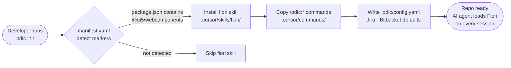
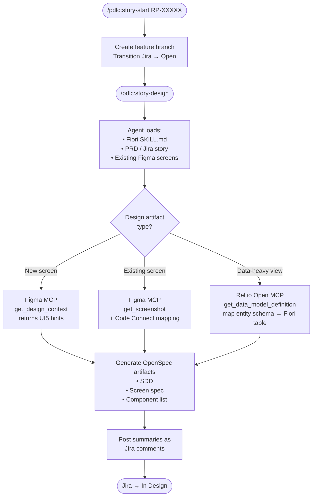
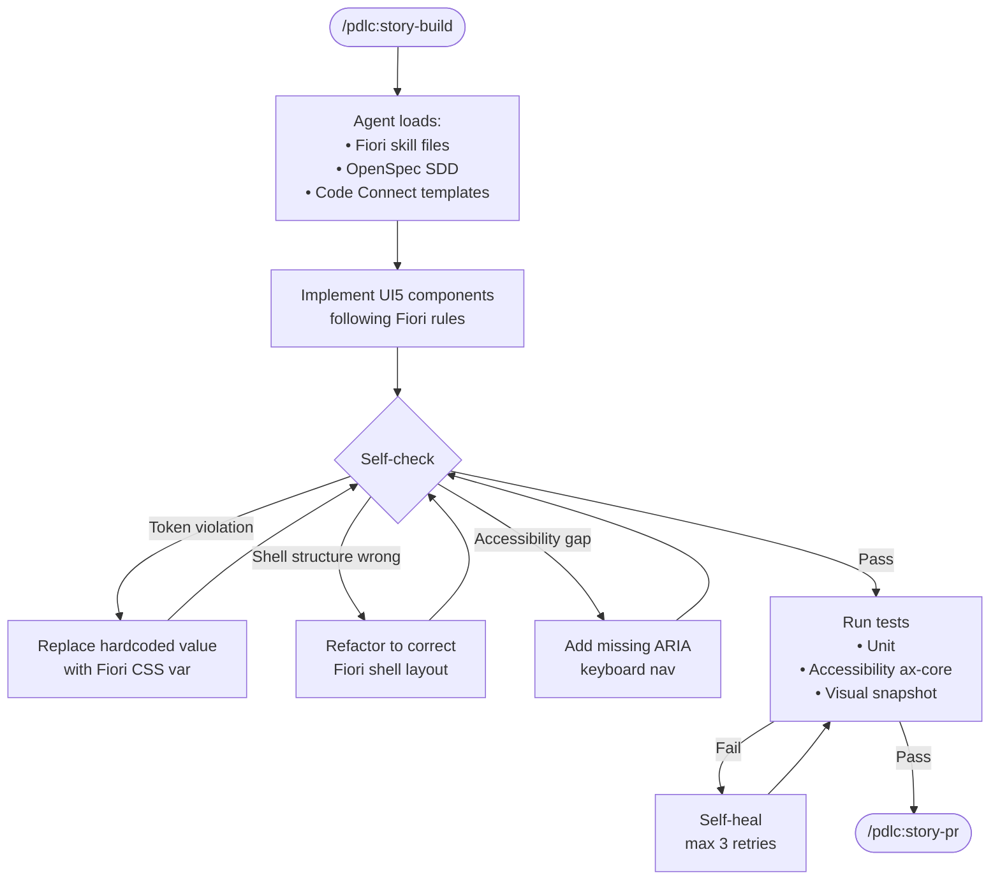
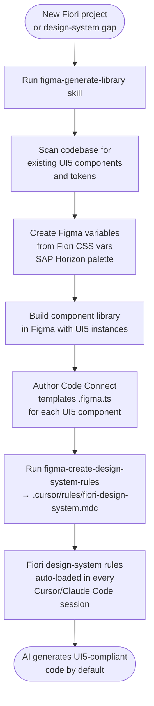
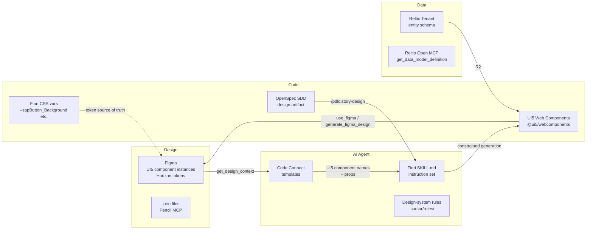
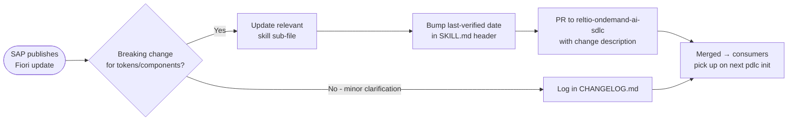

# SAP Fiori Design Integration — AI SDLC

> **Status:** Draft
> **Owner:** Ved Sarkar
> **Last verified against Fiori guidelines:** 2026-04-28
> **Applies to:** Any Reltio repo using SAP UI5 / Fiori web components

---

## 1. The Core Idea

SAP Fiori has hundreds of pages of design guidelines covering spacing, color tokens,
shell structure, component behavior, accessibility, and interaction patterns. AI agents
(Cursor, Claude Code) approximate these rules — producing output that is directionally
correct but fails on specifics (wrong touch targets, incorrect semantic colors, broken
shell layout, etc.).

**The fix:** encode the Fiori guidelines as structured `.md` skill files and load them
as agent context at the start of every session, the same way `reltio-ondemand-ai-sdlc`
loads org-standards, platform, and language skills today.

> *"If we create a `.md` file with all the Fiori design guidelines and add it as an
> instruction set with the design system it should produce better results."*
> — Ved Sarkar, 2026-04-28

---

## 2. High-Level Architecture

```mermaid
flowchart TD
    A([Fiori Design Guidelines\nSAP Official Source]) -->|distilled & versioned| B[skills/design/fiori/\nSHARDED SKILL FILES]

    B --> B1[SKILL.md\nindex + agent instructions]
    B --> B2[foundations.md\ncolors · spacing · grid · type]
    B --> B3[shell.md\nlaunchpad · header · sidebar]
    B --> B4[components.md\nButton · Table · Form · Dialog]
    B --> B5[patterns.md\nObject Page · List-Detail · Wizard]
    B --> B6[accessibility.md\nARIA · keyboard · contrast]
    B --> B7[theming.md\nCSS vars · dark mode · SAP Horizon]

    B1 --> C{pdlc init\nin consumer repo}

    C -->|detects @ui5/webcomponents\nor @sap/ui5-builder| D[.cursor/skills/fiori/\ninstalled in consumer repo]

    D --> E[AI Agent\nCursor · Claude Code]

    E --> F1[/pdlc:story-design\ngenerate SDD + Fiori screen spec]
    E --> F2[Figma MCP\nget_design_context returns\nUI5 component names]
    E --> F3[Code generation\nUI5-compliant components\ncorrect tokens + structure]

    F1 & F2 & F3 --> G[PR via /pdlc:story-pr\nCI gate via /pdlc:story-gate]
```

---

## 3. Skill File Structure

The Fiori skill is **sharded** — one file per concern — so the agent loads only what
is relevant to the current task without overflowing the context window.

```
reltio-ondemand-ai-sdlc/
└── skills/
    └── design/
        └── fiori/
            ├── SKILL.md              ← index: when to load which sub-file
            ├── foundations.md        ← colors, typography, spacing, grid
            ├── shell.md              ← launchpad, header, sidebar, notifications
            ├── components.md         ← Button, Table, Form, Dialog — key rules
            ├── patterns.md           ← Object Page, List-Detail, Wizard, Search
            ├── accessibility.md      ← ARIA roles, keyboard nav, contrast minimums
            └── theming.md            ← CSS variables, SAP Horizon, dark mode
```

Each sub-file follows the same format used by the existing Java skill:

```
## [Topic]
### Rule / Guideline
<concise, actionable constraint — no prose>

### DO
<example>

### DON'T
<anti-pattern>

### Reference
<SAP Fiori guidelines URL>
```

---

## 4. SDLC Integration Flow

### 4a. One-time Repo Bootstrap



### 4b. Story Lifecycle — Design Phase



### 4c. Story Lifecycle — Build Phase



### 4d. Design-System Setup (First Time)



---

## 5. Data Flow: Figma ↔ Code ↔ Reltio



---

## 6. Skill File Content — Scope per File

| File | What to include |
|---|---|
| `foundations.md` | 8px grid, spacing scale, Fiori color tokens (`--sapHighlightColor`, semantic colors), typography ramp, responsive breakpoints (phone/tablet/desktop) |
| `shell.md` | ShellBar height/padding, side navigation collapsed/expanded states, launchpad tile grid, notification panel, user action menu |
| `components.md` | Per-component: min touch target (44×44px), required ARIA, mandatory vs optional props, busy state, empty state, error state |
| `patterns.md` | Object Page sections + anchor bar, List-Detail split ratios, Wizard step constraints, Filter Bar layout, Sort/Group/Filter dialog |
| `accessibility.md` | WCAG 2.1 AA minimum, required `aria-label` patterns, keyboard navigation order, focus management, High Contrast Black/White support |
| `theming.md` | SAP Horizon (Morning/Evening), Quartz Light/Dark, custom theme scope, CSS variable override patterns, `ThemeProvider` usage |

---

## 7. Manifest Registration

Add to `skills/manifest.yaml` in `reltio-ondemand-ai-sdlc`:

```yaml
- id: design/fiori
  category: design
  installMode: detect
  detect:
    - package.json:@ui5/webcomponents
    - package.json:@sap/ui5-builder
    - package.json:@ui5/cli
  path: design/fiori/SKILL.md
  description: SAP Fiori design guidelines — tokens, shell, components, patterns, accessibility
```

This means `pdlc init` auto-installs the Fiori skill in any repo that has UI5 in its
`package.json` — no manual step needed for developers.

---

## 8. Freshness Strategy

Fiori guidelines evolve. Without a freshness process the skill files drift and produce
outdated output.



**Cadence:** Review against [experience.sap.com/fiori-design-web](https://experience.sap.com/fiori-design-web) quarterly, or when SAP releases a major UI5 version.

---

## 9. Open Questions

- [ ] Who owns the Fiori skill files in the ai-sdlc repo? (author + reviewer)
- [ ] Which UI5 version is the baseline? (`@ui5/webcomponents` 2.x or 1.x?)
- [ ] Is SAP Horizon the only supported theme, or do we also target Quartz?
- [ ] Are there existing Code Connect templates (`.figma.ts`) for UI5 components in any Reltio repo?
- [ ] Is there a Fiori-specific Figma library already linked to the team's Figma workspace?
- [ ] Should the accessibility file reference Reltio's internal a11y standard or pure WCAG 2.1 AA?

---

## 10. References

| Resource | URL |
|---|---|
| SAP Fiori Design Guidelines | https://experience.sap.com/fiori-design-web |
| UI5 Web Components | https://sap.github.io/ui5-webcomponents |
| SAP Horizon Theme | https://experience.sap.com/fiori-design-web/foundation/themes |
| Code Connect (Figma) | https://www.figma.com/developers/code-connect |
| AI SDLC `skills/design/` | `reltio-ondemand-ai-sdlc-ca6aba6efbad/skills/design/` |
| Transparent Factory — Test Strategy | `reltio-ondemand-transparent-factory-b1601e64ef9c/engineering/test_strategy.md` |
| Transparent Factory — Definition of Done | `reltio-ondemand-transparent-factory-b1601e64ef9c/pm/definition-of-done.md` |
